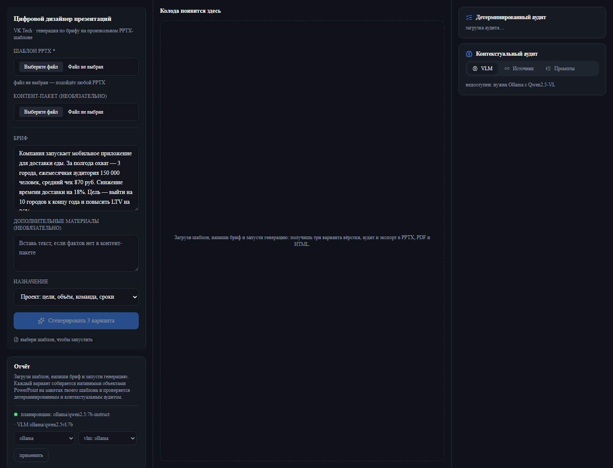
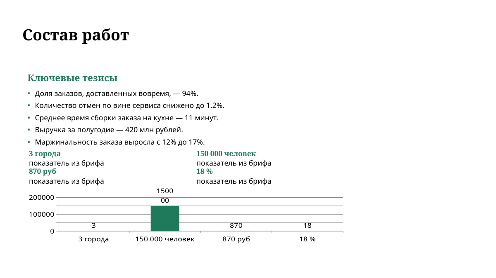

# Цифровой дизайнер презентаций

Сервис собирает презентацию из текстового брифа **по произвольному PPTX-шаблону**:
разбирает дизайн-систему (палитра, шрифты, типографическая шкала, сетка, роли
макетов), генерирует структуру и контент локальной LLM, верстает **нативными
объектами** PowerPoint в трёх вариантах, аудитирует результат (детерминированно,
VLM и сверкой с источником) и отдаёт `.pptx`, `.pdf` и `.html`.

Хакатон VK Tech 2026. Только open-weights модели через Ollama, без платных API.

## Быстрый старт

Проверенная на чистой машине последовательность (лог — `docs/REPRODUCIBILITY.md`):

```bash
git clone <repo> && cd <repo>
docker compose up --build     # первая сборка 4–9 мин, модели ~12 ГБ
```

* UI — http://localhost:3000 (выберите `examples/synthetic_16x9.pptx`, при
  желании контент-пакет `examples/builtin_corpus.md`, нажмите
  «Сгенерировать 3 варианта»)
* API — http://localhost:8000/docs

Локальный `.env` не обязателен: без него работают открытые веса Ollama
(`qwen2.5:7b-instruct`, `qwen2.5vl:7b`, `bge-m3`) — зачётная конфигурация без
внешних сервисов. Первый старт скачивает модели в volume `ollama_data`
(несколько ГБ); прогресс — `docker compose logs -f ollama`.

На **CPU** рекомендовано `cp .env.example .env` и `VLM_AUDIT_ENABLED=false`:
локальная 7B не успевает за бюджет стадии, сервис честно уходит в
офлайн-планировщик (`offline-fallback` в отчёте), полный прогон — около
135 секунд. На GPU работают все стадии.

Альтернатива одной командой — `./start.sh` (то же `docker compose up --build`
плюс ожидание готовности и создание `.env`): `--no-build`, `--local`
(без Docker: uvicorn + next dev), `--with-assets DIR` (скопировать шаблоны),
`--logs`, `-h`.

Без Ollama сервис работает в режиме офлайн-планировщика: колода, вёрстка, аудит
и экспорт доступны полностью, в отчёте честно помечается `offline-fallback`.

**Провайдеры моделей.** Выбираются переменными `LLM_PROVIDER` и `VLM_PROVIDER`;
по умолчанию (и без `.env`) — `ollama`, то есть зачётная конфигурация:

| Значение | Что это |
|---|---|
| `ollama` | локальные открытые веса: Qwen2.5 7B/14B, Qwen2.5-VL 7B, BGE-M3 — эталон для сдачи по ТЗ (по умолчанию) |
| `aitunnel` | OpenAI-совместимый шлюз AITUNNEL, модель `qwen3.5-9b` (Qwen, Apache 2.0) — и планировщик, и VLM-аудит (ADR-020); включается в `.env` для отборочного этапа |
| `openai_compat` | любой другой OpenAI-совместимый шлюз (ADR-019) |
| `off` | только для `VLM_PROVIDER`: VLM-аудит выключен |

Ключи живут исключительно в `.env` (файл в `.gitignore`, страхует
`scripts/hooks/pre-commit`). Проверка настройки — `python tools/llm_check.py
--json-call` (и `--vlm` для аудита). В отчёте задания видно, кто собрал колоду:
`planning: aitunnel/qwen3.5-9b` или `offline-fallback`. Подробности —
`docs/MODELS.md`, `docs/DECISIONS.md` (ADR-019, ADR-020).

## Состояние по требованиям ТЗ

| Требование ТЗ | Статус | Где смотреть |
|---|---|---|
| Парсинг шаблона и извлечение дизайн-системы | сделано: тема, макеты, палитра, шрифты, шкала, сетка, поля, фирменные элементы; проверено на шаблоне с макетами `Layout N` | ADR-010, ADR-021, `backend/app/template/` |
| Роли и паттерны макетов без привязки к именам | сделано: структура плейсхолдеров, картинок и геометрии; имя — только подсказка | ADR-010, `tools/audit_matrix.py --layouts` |
| Генерация структуры и текста через LLM | сделано: Qwen3.5-9b через AITUNNEL (и Qwen2.5 локально) + строгая Pydantic-схема, чек-лист ограничений, детерминированная нормализация, запасная модель, офлайн-fallback | ADR-020, ADR-022, `backend/app/planner/`, `prompts/planner/` |
| Импорт и декомпозиция контент-пакетов | сделано: PPTX, DOCX, TXT/MD → тезисы, таблицы, диаграммы, цифры, изображения | `backend/app/content/` |
| Рендер нативными объектами | сделано: текст, автофигуры, таблицы, диаграммы, картинки; растровых слайдов нет | `backend/app/render/` |
| Три варианта вёрстки одного контента | сделано: плотность / группировка / порядок+визуализация, все проходят аудит | ADR-003, `backend/app/layout/` |
| Детерминированный аудит | 26 кодов проблем, включая токены шаблона, контраст, плотность, дубли | `docs/AUDIT.md` |
| Контекстуальный аудит (VLM) | сделано: ровно 11 вопросов Приложения 1 с межслайдовым контекстом | `backend/app/audit/vlm.py`, `prompts/vlm/` |
| Опора на источник (эмбеддинги) | сделано: числа против корпуса, семантические дубли (BGE-M3) | `backend/app/retrieval/` |
| Пользователь выбирает, что исправить | сделано: чекбоксы по `issue.id` + детерминированные авто-фиксы | ADR-007, `backend/app/audit/fixes.py` |
| Версионирование промптов и скиллов | сделано: манифест с версиями и хэшами, версии пишутся в задание | ADR-013, `prompts/registry.json` |
| Экспорт PPTX / PDF / HTML | сделано: нативный PPTX, LibreOffice headless, автономный HTML | `backend/app/export/`, `backend/app/render/pdf.py` |
| Веб-интерфейс на React/Next + Tailwind + shadcn | сделано: Tailwind с токенами shadcn/ui и собственные примитивы | ADR-018, `frontend/` |
| Docker Compose, воспроизводимый запуск | сделано: ollama + backend (с LibreOffice) + frontend | `docker-compose.yml` |
| Время генерации ≤ 5 минут | сделано: три варианта за 1.7–5.4 с без моделей; замеры в ADR-012 | `scripts/e2e.sh` |
| Text-to-image (задача со звёздочкой) | сделано: `kind=image` с `image_prompt` → FLUX.2 [klein] 4B (Apache 2.0) через `/images/generations`, 3.6 с на картинку, нативная вставка с сохранением пропорций; fallback — картинка из контент-пакета → слот шаблона | ADR-028, `backend/app/imagegen.py`, `docs/evidence/imagegen/` |

## Метрики

* **179 тестов** (`pytest`), включая негативный кейс на каждую проверку аудита,
  устойчивость схемы к ошибкам модели, переключение провайдера и генерацию
  иллюстраций.
* **Матрица качества** (`tools/audit_matrix.py`, 8 шаблонов × 3 варианта):
  **0 ошибок аудита**, 24 из 24 комбинаций полностью чистые; остальные три —
  только предупреждения (`docs/PROJECT_OVERVIEW.md` §7).
* **Сквозной прогон** `scripts/e2e.sh`: 7 шаблонов (3 VK + 3 фикстуры +
  мутированный «незнакомый») × 3 варианта — 0 ошибок, 6 секунд на CPU без моделей.
* **Три сторонних шаблона** (MIT): `tools/e2e_9variants.py` — 9 презентаций,
  0 ошибок, 31–47 с на шаблон с VLM.
* **Незнакомый шаблон** `tools/e2e_unfamiliar.py`: макеты переименованы в
  `Layout 1..N`, роли определены по структуре — 0 ошибок.
* **Живое демо** (`tools/demo_rehearsal.py`): три прогона подряд — **58.1 / 58.3 /
  69.5 с** из бюджета 420 с.
* **Чистая машина на CPU** (`docs/REPRODUCIBILITY.md`): от `git clone` до готовой
  презентации с PPTX/PDF/HTML — **135 с** (VLM-аудит на CPU выключается, см.
  ограничения).
* Бюджет ТЗ — 300 секунд на колоду; замеры стадий в `docs/DECISIONS.md` ADR-012.

## Скриншоты

UI после запуска на чистой машине (форма, встроенный бриф, селекторы провайдеров):



Слайд сгенерированной колоды (миниатюра из API — тот же рендер, что в UI):



Ключевые пары «до/после» правок вёрстки (этап D): KPI-слайд с акцентом шаблона и
центрированием, шевроны без переполнения, вертикальный заголовок без обрезки,
карточки без наложений — `docs/evidence/visual/`. Девять вариантов
(3 шаблона × 3 вёрстки) — `docs/evidence/pitch/`.

## Честные ограничения

Осознанные trade-off'ы, а не недоделки (подробно — `docs/README.md` §7 и
`docs/PROJECT_OVERVIEW.md` §8):

* **CPU vs GPU.** Локальные 7B-модели на CPU не укладываются в бюджет 5 минут:
  планирование честно уходит в офлайн-планировщик (`offline-fallback` в отчёте),
  VLM-аудит на CPU рекомендуем выключать (`VLM_AUDIT_ENABLED=false`). На GPU
  работают все стадии: замеры в `docs/DEMO.md`.
* **VLM-аудит — опциональная стадия.** Недетерминирован по природе метода; при
  недоступности модели помечает себя `available: false` и не влияет на остальной
  пайплайн (детерминированный аудит и grounding работают всегда).
* **Генерация иллюстраций по умолчанию выключена** (`IMAGE_PROVIDER=off`):
  зачётная конфигурация не зависит от внешних сервисов; включается одной строкой
  в `.env` (ADR-028).
* **Кириллический путь и Docker BuildKit.** На пути с кириллицей `docker compose
  build` требует `DOCKER_BUILDKIT=0`; на латинском пути (например,
  `C:\temp\clean-checkout`) собирается штатно (проверено, `docs/REPRODUCIBILITY.md`).
* **Шрифты шаблона.** Если гарнитура не установлена в контейнере, LibreOffice
  подставит свою в PDF/миниатюрах; в PPTX шрифт сохраняется как есть.
* **Большие шаблоны и контент-пакеты не в git** (ADR-002): положить файлы в
  `data/templates/` или загрузить через UI; в репозитории — только JSON-профили.

## Что нужно положить вручную

Шаблоны и контент-пакеты не хранятся в git (большие бинарники, ADR-002). Положите
файлы в `data/templates/` — сервис принимает любой PPTX через UI, настраивать
ничего не нужно. Для быстрого старта в репозитории есть встроенные примеры:
`examples/synthetic_16x9.pptx` (шаблон, 30 КБ) и `examples/builtin_corpus.md`
(контент-пакет). Тесты не зависят от внешних файлов: для них генерируются
синтетические фикстуры (`python tools/make_fixtures.py`).

## Документация

| Документ | Содержание |
|---|---|
| [docs/README.md](docs/README.md) | полный сетап, переменные окружения, ограничения, troubleshooting |
| [docs/ARCHITECTURE.md](docs/ARCHITECTURE.md) | пайплайн и границы слоёв, API, хранилище, фронтенд |
| [docs/MODELS.md](docs/MODELS.md) | модели, области применения, требования, ссылки на HuggingFace |
| [docs/AUDIT.md](docs/AUDIT.md) | все проверки, детерминированные и контекстуальные, покрытие тестами |
| [docs/DECISIONS.md](docs/DECISIONS.md) | журнал архитектурных решений (ADR-001…ADR-028) |
| [docs/DEMO.md](docs/DEMO.md) | сценарий демо и питча на 7 минут с таймингом |
| [docs/REPRODUCIBILITY.md](docs/REPRODUCIBILITY.md) | лог проверки на чистой машине: команды, вывод, время |

## Структура репозитория

```
backend/            FastAPI, парсер шаблонов, контент-пакеты, планировщик,
                    вёрстка, рендер, аудит, авто-фиксы, хранилище
frontend/           Next.js + Tailwind + компоненты в духе shadcn/ui
prompts/            промпты и конфиги агентов + манифест версий
template_profiles/  JSON-профили дизайн-систем разобранных шаблонов
tests/fixtures/     синтетические PPTX для тестов (генерируются скриптом)
tools/              dev-скрипты: профили, e2e-рендер, матрица аудита, smoke API
scripts/            воспроизводимые сценарии: e2e.sh, fetch_assets, sync_prompts
docs/               документация
docker-compose.yml  ollama + backend (с LibreOffice) + frontend
```

## Лицензии моделей

Только Apache 2.0 / MIT, до 35B параметров: Qwen2.5 Instruct (Apache 2.0),
Qwen2.5-VL (Apache 2.0), BGE-M3 (MIT). Подробности — `docs/MODELS.md`.
