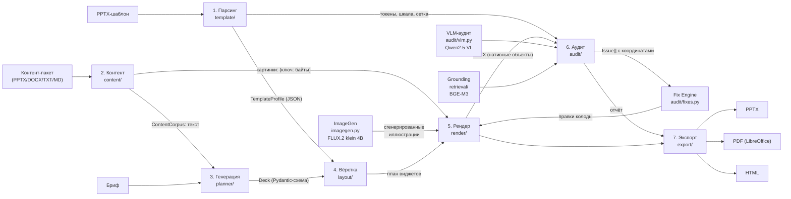

# PROJECT OVERVIEW: что мы построили и почему это работает

Главный документ для понимания проекта. Читается за 15–20 минут; после него
любой член команды отвечает на вопросы судей, опираясь на факты и ссылки.

## Оглавление

1. [Что мы сделали](#1-что-мы-сделали)
2. [Проблема, которую решаем](#2-проблема-которую-решаем)
3. [Наш подход](#3-наш-подход)
4. [Архитектура](#4-архитектура)
5. [Как это работает end-to-end](#5-как-это-работает-end-to-end)
6. [Ключевые технические решения](#6-ключевые-технические-решения)
7. [Что мы проверили](#7-что-мы-проверили)
8. [Что мы осознанно не сделали](#8-что-мы-осознанно-не-сделали)
9. [Почему это выигрывает по критериям ТЗ](#9-почему-это-выигрывает-по-критериям-тз)
10. [Словарь терминов](#10-словарь-терминов)
11. [FAQ для защиты](#11-faq-для-защиты)

---

## 1. Что мы сделали

**Одно предложение.** Сервис читает произвольный корпоративный PPTX-шаблон как
набор правил дизайн-системы и собирает по нему новую презентацию из текстового
брифа — тремя визуально разными, одинаково валидными вариантами вёрстки,
с аудитом и авто-фиксами, экспортом в PPTX/PDF/HTML и без единого платного
вызова модели.

**Один абзац.** На входе — чужой файл (шаблон VK, Slidesgo, китайский
академический — любой) и бриф. Парсер извлекает тему, палитру, шрифты,
типографическую шкалу, сетку и роли макетов в JSON-профиль. Локальная LLM
(Qwen2.5 через Ollama; на отборочном этапе — Qwen3.5-9B через шлюз) планирует
колоду 10–15 слайдов по строгой Pydantic-схеме, детерминированная нормализация
чинит типовые сбои модели. Вёрстка раскладывает блоки по макетам шаблона
(исключительно на его токенах), рендер собирает слайды нативными объектами
python-pptx: текст, автофигуры, таблицы, диаграммы, картинки — никаких
растровых слайдов. Аудит проверяет результат в трёх слоях: 29 детерминированных
проверок геометрии и токенов, 11 вопросов Приложения 1 через VLM и опора на
источник через эмбеддинги; 20 из найденных проблем исправляются
детерминированными авто-фиксами без модели. Иллюстрации при необходимости
генерирует FLUX.2 [klein] 4B (Apache 2.0). Всё воспроизводится одной командой
`docker compose up --build`, 219 тестов, матрица 8 шаблонов × 3 варианта без
ошибок в обоих путях сборки.

### Что нового в 2.0

| Блок | Что добавлено | Где |
|---|---|---|
| Второй рендерер | Тот же widget-план собирается в автономный HTML+CSS (токены шаблона → `:root`, блоки в процентах от слайда, SVG-диаграммы, инлайн CSS/JS без CDN) | `render/html_renderer.py`, ADR-035 |
| HTML→PPTX | Разбор DOM и инлайн-CSS в **нативные** фигуры python-pptx: текстовые рамки с runs, буллеты/автонумерация, таблицы, диаграммы, шевроны, подложки, contain-картинки. Растеризация запрещена | `render/html_to_pptx.py`, ADR-036 |
| Режим сборки в UI | Шаг 3: «Классический / Через HTML+CSS / Оба»; на результате — кнопки «Скачать PPTX (классический)», «Скачать PPTX (через HTML)» и «Открыть HTML» | `generator-form.tsx`, `result-view.tsx` |
| Единый аудит | Оба PPTX проходят один и тот же детерминированный аудит; различия geometry не подгоняются, а честно показываются | `audit_matrix.py --html` — 48/48 чисто |
| Контраст по факту | ThemePair (`background/foreground/accent/muted`) из `p:bg`; проверка `text_invisible` (< 3:1); автоподбор белый/чёрный | ADR-034 |

---

## 2. Проблема, которую решаем

По ТЗ: подготовка корпоративной презентации — это не «написать текст», а
«уложить текст в дизайн-систему». Автор пишет бриф, дизайнер вручную
переверстывает слайды: подбирает макет, двигает блоки, приводит цвета и кегли к
гайдлайнам, собирает диаграмму в фирменной палитре.

Существующие AI-инструменты закрывают первую половину задачи и не закрывают
вторую:

* **Генераторы контента** (ChatGPT и подобные) хорошо пишут текст и не знают
  про конкретный PPTX: они не читают файл как набор правил, не воспроизводят
  сетку, шкалу, роли макетов и фирменные элементы.
* **Генераторы «с нуля»** (Gamma, Tome) делают красивые слайды в *своём*
  дизайне. Корпоративный шаблон для них — картинка-референс, а не исполняемая
  спецификация.
* **Ручная переверстка** остаётся узким местом: десятки колод в неделю,
  часы работы дизайнера на каждую.

Разрыв — в отсутствии адаптера между «чужим файлом-шаблоном» и новым
содержанием. Мы закрываем его: шаблон становится данными, контент — смыслом,
вёрстка — детерминированным применением токенов шаблона.

---

## 3. Наш подход

**Шаблон — это данные, а не код.** Мы не «рисуем похоже»: парсер вытаскивает из
файла измеримые правила (палитра, шрифты, шкала, сетка, геометрия плейсхолдеров,
роли макетов) и складывает их в JSON-профиль. Ни одного знания о конкретном
бренде в коде нет — на защите это проверяется незнакомым шаблоном.

**LLM отвечает за смысл, а не за вёрстку.** Модель получает бриф и контент-пакет
и возвращает структуру по строгой схеме: заголовки-выводы, блоки, фактоиды,
таблицы, диаграммы. Где ставить блоки, каким кеглем и цветом — решает вёрстка по
профилю шаблона. Это развязывает руки: смена шаблона не требует смены промпта,
а смена модели не ломает дизайн.

**Аудит — часть пайплайна, а не внешняя проверка.** Каждая проблема — объект
`Issue {code, severity, slide, message, bbox}`: её видно в UI, по ней можно
применить детерминированный авто-фикс и убедиться, что стало чисто. Поэтому
качество измеряется, а не обсуждается: «24 из 24 комбинаций шаблон × вариант —
ноль ошибок» — это результат прогона, а не обещание.

**Только открытые веса.** Qwen2.5 7B/14B, Qwen2.5-VL 7B, BGE-M3, FLUX.2 [klein]
4B — все с лицензиями Apache 2.0/MIT, проверенными по карточкам первоисточников.
Зачётная конфигурация работает без внешних API: `docker compose up` поднимает
Ollama с моделями локально.

---

## 4. Архитектура

Правило зависимостей: слой знает только о слоях слева и о двух контрактах —
`Deck` (Pydantic-схема колоды) и плане виджетов (`{widget, rect, block, style}`).
`layout/` не читает PPTX-байты, `render/` не ходит в LLM, `audit/` не мутирует
колоду, `export/` не знает про шаблон больше, чем токены дизайна.

### 4.1 Ingestion — что принимаем на вход

* **Шаблон**: любой `.pptx` (лимит 60 МБ). Профиль строится на лету при
  загрузке; для известных шаблонов кэшируется в `template_profiles/`.
* **Бриф**: текст (≥20 символов) и назначение (`feature`/`product`/`project`/
  `initiative`) — влияет на структуру через `prompts/planner/purpose.json`.
* **Контент-пакет** (опционально): PPTX, DOCX, TXT, MD → тезисы, таблицы,
  диаграммы, цифры, изображения. Текст — единственный источник фактов,
  картинки — реестр `{ключ: байты}` для нативного встраивания.
* **Ключевое решение:** дальше идут только два JSON-контракта (`Deck` и профиль);
  ни один слой не работает с «сырыми» байтами шаблона.

### 4.2 Template Decomposer — `backend/app/template/`

Парсер (`parser.py`) извлекает: цветовую схему темы и палитру по частоте,
шрифты (major/minor + восточноазиатские), типографическую шкалу из реальных
слайдов, сетку и поля, геометрию плейсхолдеров каждого макета, декор с заливками
(обход групп, доминирующий цвет картинок), фирменные элементы и паттерны
композиции. Выход — `TemplateProfile` (JSON).

Роль макета (`title`/`content`/`section`/`agenda`/`final`) и композиционный тип
(`bullets`, `multi_column`, `image`, `image_text`, `table`, `chart`, `blank`)
выводятся **из структуры**: типы и количество плейсхолдеров, картинки, свободные
текстовые фигуры, геометрия заголовка. Имя — только tie-breaker по однозначным
словам; решение объяснимо (`role_reason`: «тело-подзаголовков 4», «имя: раздел»).

**Чем отличается от наивной реализации.** Наивно — искать макет по имени
(«Title Slide») и падать на шаблоне с макетами `Slide 1…N`. У нас роль —
следствие структуры, поэтому шаблон с переименованными макетами обрабатывается
так же (`tools/audit_matrix.py --layouts`, ADR-010, ADR-025).

### 4.3 Content Planner — `backend/app/planner/`

LLM получает: системный промпт с жёсткими правилами (`prompts/planner/`),
бриф, текст контент-пакета, список доступных изображений и JSON-схему ответа
(`Deck.model_json_schema()`). Возвращает колоду: 10–15 слайдов, у каждого —
заголовок-вывод, тип, блоки (`bullets`, `text`, `factoids`, `table`, `chart`,
`quote`, `steps`, `numbered`, `image`).

Как боремся с галлюцинациями и сбоями схемы — четыре уровня:

1. **Промпт**: жёсткие ограничения (первый слайд — титул, ≤15 слайдов, ≤6
   буллетов по ≤15 слов, цифры только из источников, заголовок — вывод).
2. **Валидация** Pydantic-схемой; ошибки возвращаются модели на исправление
   (до 3 попыток).
3. **Нормализация** (`normalize.py`, без модели): первый слайд, лишние слайды,
   дубликаты, пустые блоки, длинный абзац, текст в полях вне схемы — все правки
   видны в отчёте задания.
4. **Офлайн-планировщик** (`fallback.py`): если модель недоступна, колода
   собирается детерминированно; в отчёте честно `offline-fallback`.

**Чем отличается от наивной реализации.** Наивно — «попросить JSON и надеяться».
У нас модель может ошибаться: схема, нормализация и офлайн-план гарантируют, что
на выходе всегда валидная колода, а не 500-я ошибка.

### 4.4 Layout Matcher — `backend/app/layout/`

Два шага. Первый — **выбор макета** (`Renderer._pick_layout`): по типу слайда
(титул/раздел/оглавление/контент/финал) и композиционному типу его блоков
(таблица, диаграмма, картинка+текст, много колонок) среди макетов нужной роли
выбирается лучший по `score` (заполненность плейсхолдеров, размер заголовка,
наличие слота под картинку). Второй — **план виджетов**
(`LayoutEngine.compose`): блоки раскладываются в прямоугольники контентной
области макета; высоты распределяются по содержимому (`fit_heights`), при
нехватке места текстовые блоки защищены, а сжимаются визуальные.

**Чем отличается от наивной реализации.** Наивно — один универсальный макет
«заголовок + список». У нас слайд с диаграммой получает макет с диаграммой,
слайд с картинкой — макет с image-слотом, и всё это на незнакомом шаблоне,
потому что решение опирается на структуру, а не на имена.

### 4.5 Renderer — `backend/app/render/`

python-pptx собирает слайды **нативными объектами**: текст — фигуры с runs,
списки — настоящие буллеты (`buChar`) и нумерация (`buAutoNum`), процессы —
шевроны, данные — таблицы и диаграммы PowerPoint, картинки — `add_picture` с
сохранением пропорций. Цвета и кегли — только из токенов профиля.

Цвет текста выбирается по **фактическому фону**: заливка фигуры → декор макета
под рамкой → фон `p:bg` макета → палитра. Тёмные шаблоны (VK WorkSpace задаёт
`p:bg = #000000`) получают светлый текст, а не «тёмное на тёмном» (ADR-034).

Крупные почти чёрные фоновые картинки макета, выходящие за границы слайда
(шумовые полотна «0 / 0 / 0» Google-Slides-экспорта), из готового файла
удаляются: это декор, а не содержание колоды.

**Чем отличается от наивной реализации.** Наивно — отрендерить слайд картинкой
или поставить чёрный текст на тёмную плашку. У нас каждый объект редактируется в
PowerPoint (проверено: 28 текстовых фигур с 45 runs, 1 диаграмма, 0 растровых
слайдов — `docs/REPRODUCIBILITY.md`).

### 4.6 Auditor — `backend/app/audit/`

Три слоя, каждый со своим назначением:

* **Детерминированный** (`checks.py`, 29 кодов): границы и поля, наложения,
  переполнение текста, кегли вне шкалы, цвета вне палитры, контраст WCAG к
  фактическому фону, «невидимый» текст (`text_invisible`, контраст < 3:1) и
  пустые текстовые рамки (`empty_text_frame`), плотность и пустые половины,
  размеры таблиц, подписи диаграмм, заглушки, дубли, растровые слайды, сдвиг
  фирменных элементов, картинка в слоте. Один файл — один результат: годится
  для CI и авто-фиксов. Аудит запускается автоматически сразу после генерации
  (ADR-032): пользователь не нажимает «проверить».
* **Контекстуальный** (`vlm.py`): Qwen2.5-VL отвечает ровно на 11 вопросов
  Приложения 1 по изображению слайда; в промпт передаются язык колоды и
  заголовки соседних слайдов — иначе вопросы 9 и 11 непроверяемы. Стадия
  недетерминирована по природе метода (зафиксировано в ТЗ), поэтому честно
  помечается `deterministic: false`.
* **Опора на источник** (`retrieval/grounding.py`): числа со слайдов сверяются
  с брифом и контент-пакетом (детерминированно), смысловая близость и
  семантические дубли — через эмбеддинги BGE-M3.

**Чем отличается от наивной реализации.** Наивно — «прогнать VLM и поверить».
У нас аудит разделён: точные проверки отделены от оценочных, у каждой проблемы
есть код, серьёзность, слайд и координаты для подсветки, а разделение видно в UI
двумя блоками (ADR-029).

### 4.7 Fix Engine — `backend/app/audit/fixes.py`

20 детерминированных авто-фиксов без модели: разбить перегруженный слайд
(`split_slide`), слить пустой с соседним (`merge_slide`), сменить макет
(`switch_layout`), уменьшить кегль на ступень шкалы (`shrink_font`), укоротить
буллет (`shorten_bullet`), заменить нечитаемую визуализацию (`replace_visual`),
убрать блок-заглушку (`drop_block`), удалить дубль слайда, переименовать
дублирующийся заголовок и другие.

Все исправимые проблемы **применяются автоматически сразу после аудита, без
подтверждения** (ADR-032); если шкала кеглей исчерпана, переполнение лечится
переносом контента на слайд-продолжение. В отчёте видно, что применено, что
осталось и почему — секции «Исправлено автоматически», «Можно исправить
автоматически» и «Требуют внимания» на экране результата.

**Чем отличается от наивной реализации.** Наивно — «пусть LLM перепишет
проблемный слайд»: результат недетерминирован, проверить его нельзя. У нас фикс
— функция от колоды, эффект проверяется повторным аудитом (`tools/audit_demo.py`:
4 ошибки → два прохода → 0).

### 4.8 Variant Engine — три варианта вёрстки

Один контент, один шаблон, три оси **композиции** (ADR-003):

| Вариант | Ось | Что меняется |
|---|---|---|
| `compact` | плотность | полосы во всю ширину, минимальные зазоры, порядок блоков сохраняется |
| `cards` | группировка | каждый блок — карточка в сетке 2×N со своей рамкой и заголовком |
| `split` | порядок + визуализация | блоки данных (таблица/диаграмма/фактоиды) отделяются в колонку и поднимаются выше текста |

Примеры: `docs/examples/` (3 сторонних шаблона × 3 варианта, скриншоты), обосно-
вание осей — там же и в ADR-003. Все три варианта проходят один и тот же аудит:
в матрице 24/24 комбинации чистые.

### 4.9 Exporter — `backend/app/export/`, `render/pdf.py`

Экран результата отдаёт **три варианта вёрстки × выбранные форматы** (PPTX
и/или PDF) — ADR-033: имя файла `presentation_{variant}.pptx`, скачивание
только по клику через `Content-Disposition: attachment`, кнопка «Скачать всё
одной кнопкой» собирает ZIP со всеми выбранными файлами
(`GET /api/jobs/{id}/download`). Никаких превью и встроенных просмотрщиков на
основном экране.

PPTX — нативный файл на макетах шаблона. PDF — LibreOffice headless
(`soffice --convert-to pdf`), поэтому визуально совпадает с PPTX; если
LibreOffice недоступен, эндпоинт отдаёт 503 с понятным текстом, карточка PDF
показывает серую плашку «PDF недоступен», а PPTX продолжает работать. HTML —
автономная страница-презентация (слайд = секция, навигация стрелками) из той же
`Deck` и токенов профиля.

### 4.10 ImageGen — `backend/app/imagegen.py`

Блок `kind=image` с полем `image_prompt` (планировщик просит иллюстрацию, когда
в контент-пакете нет подходящей картинки) → OpenAI-совместимый
`/images/generations` → нативная вставка с сохранением пропорций. Модель по
умолчанию — **FLUX.2 [klein] 4B** (Apache 2.0, проверено по карточке
`black-forest-labs/FLUX.2-klein-4B`); замер: 3.6 с на картинку 1280×720.
Fallback-цепочка: картинка из контент-пакета (приоритет) → генерация →
слот-плейсхолдер шаблона (аудит помечает `image_missing` предупреждением).
Стадия выключена по умолчанию (`IMAGE_PROVIDER=off`), чтобы зачётная
конфигурация не зависела от внешних сервисов (ADR-028).

---

## 5. Как это работает end-to-end

Реальный прогон на чистой машине (лог — `docs/REPRODUCIBILITY.md`):

1. **Шаблон** `examples/synthetic_16x9.pptx` (30 КБ) → парсинг **0.6 с** →
   профиль: 11 макетов, палитра, шкала, сетка, роли (`title` 2, `content` 8,
   `section` 1), декор с заливками.
2. **Контент-пакет** `examples/builtin_corpus.md` → 5 секций, 14 цифр.
3. **Планировщик** (на CPU — офлайн после 120-секундного таймаута модели; на
   GPU/шлюзе — LLM за 10–18 с) выдаёт **8 слайдов**.
4. **Матчер** выбирает макеты: титул → `Title Slide`, данные → макет с
   диаграммой, картинка+текст → `Picture with Caption`.
5. **Рендер** собирает три варианта: **0.4 с** на все три (без моделей).
6. **Аудит**: 26 детерминированных проверок + 11 вопросов VLM (на шлюзе
   ~20–37 с) + grounding (эмбеддинги, 2–14 с). На чистой машине: **0 ошибок**,
   одно замечание grounding (слайд пересказывает бриф своими словами).
7. **Авто-фиксы** по выбранным проблемам — секунды, без модели.
8. **Экспорт**: PPTX (44 КБ), PDF (34 КБ), HTML (7 КБ) + PNG-миниатюры; объекты
   нативные, редактируемые.
9. **Итого на CPU: 135 с** до готовой презентации; на шлюзе с VLM — 60–76 с;
   бюджет ТЗ — 300 с на колоду.

С теми же шагами на **незнакомом** шаблоне (Slidesgo «Anatomy Lesson», MIT):
14 слайдов, 0 ошибок аудита, 72.7 с — включая VLM-стадию. Матрица целиком:
8 шаблонов × 3 варианта = 24 комбинации, **0 ошибок, 24/24 чистых**
(`docs/QUALITY.md`).

---

## 6. Ключевые технические решения

Человеческим языком, с отвергнутыми альтернативами. Полные формулировки —
`docs/DECISIONS.md` (ADR-001…ADR-029).

* **Почему роли макетов выводятся из структуры, а не из имён** (ADR-010,
  ADR-025). Альтернатива «искать макет по имени» ломается на первом же
  незнакомом шаблоне: `Layout 1…N`, китайские имена, Slidesgo-конвенции. Мы
  считаем структуру (плейсхолдеры, картинки, текстовые фигуры, геометрию), имя
  используем как подсказку. Побочный эффект: шаблон можно переименовать — роли
  не изменятся (тест на инвариантность).
* **Почему LLM не верстает** (ADR-004, ADR-017). Альтернатива «пусть модель
  пишет HTML слайда» нестабильна и утекает дизайн. У нас модель отвечает за
  смысл, вёрстка — применение токенов; смена шаблона не требует правки промпта.
* **Почему три варианта — плотность/группировка/порядок** (ADR-003).
  Альтернатива «три цвета одного макета» не является разными вёрстками. Мы
  выбрали оси уровня композиции: они различимы одним предложением, работают на
  любом шаблоне и проверяются аудитом.
* **Почему производные цвета — отдельная политика** (ADR-008). Альтернатива
  «разрешить любые оттенки» размывает бренд, «запретить всё» ломает светлые
  подложки. Мы разрешаем смеси палитры для заливок и запрещаем для текста;
  аудит проверяет и то и другое.
* **Почему аудит не мутирует колоду** (ADR-007). Альтернатива «аудит сразу
  исправляет» делает проверку невоспроизводимой. У нас аудит — чистый отчёт,
  фиксы — отдельный слой по явному выбору пользователя.
* **Почему офлайн-планировщик обязателен** (ADR-005). Альтернатива «без модели
  сервис не работает» превращает отказ модели в отказ продукта. Офлайн-план
  даёт валидную колоду всегда, а в отчёте честно помечается источник.
* **Почему VLM — опциональная стадия** (ADR-009). Альтернатива «VLM обязателен»
  делает пайплайн недетерминированным и дорогим. У нас смысловые проверки
  отделены от точных, стадия выключается одной настройкой, а её отсутствие
  честно видно в отчёте.
* **Почему PDF — через LibreOffice, а не свой рендер** (ADR-006). Альтернатива
  «написать свой PDF-рендер» — месяцы работы ради совпадения с PowerPoint.
  LibreOffice даёт совпадение «из коробки»; при его отсутствии PPTX и HTML
  остаются.
* **Почему промпты — файлы с версиями и хэшами** (ADR-013). Альтернатива
  «промпт в коде» не показывает, какая версия собрала колоду. У нас манифест
  `prompts/registry.json`, хэши сверяются, версии видны в задании и UI.
* **Почему text-to-image заменили модель** (ADR-011 → ADR-028). Альтернативы
  SDXL/SD3 не проходят по лицензии (OpenRAIL/Stability), FLUX.1-schnell нет у
  провайдера, klein 9B — некоммерческая. Взяли FLUX.2 [klein] 4B: Apache 2.0,
  4B параметров, 3.6 с на картинку.
* **Почему аудит разделён в UI на два блока** (ADR-029). Альтернатива «один
  список с пометками» путает точные проверки с оценочными: пользователь не
  понимает, почему для одного замечания есть кнопка «исправить», а для другого
  нет. Разделение делает границу явной.
* **Почему аудит иногда строже, чем хотелось бы** (ADR-024, ADR-027,
  ADR-029). Мы нашли и починили три «мёртвые» проверки (дюймы против EMU,
  namespace без Clark-нотации) — честнее поймать больше, чем показывать «чисто»
  на сломанной проверке.

---

## 7. Что мы проверили

### 7.1 Тесты: 180

`pytest -q` → **180 passed**. На каждую проверку аудита есть позитивный и
негативный кейс; отдельно покрыты парсер (роли, инвариантность к переименованию
макетов), нормализация колоды, три варианта вёрстки, нативные картинки с
пропорциями, авто-фиксы по эффекту в колоде, VLM с межслайдовым контекстом,
grounding, API, хранилище и бюджет времени (`docs/AUDIT.md` §4).

### 7.2 Матрица: 8 шаблонов × 3 варианта

`python tools/audit_matrix.py` → **24/24 комбинации чисто, 0 ошибок, 0
замечаний**. В матрице: 3 фикстуры (включая мутированную — имена `Slide N`,
чужие цвета и шрифты), 4 шаблона VK, 16:10-мутация. Полная таблица и что
чинили — `docs/QUALITY.md`.

### 7.3 Незнакомый шаблон

* **Мутированный**: `tools/e2e_unfamiliar.py` — макеты переименованы в
  `Layout 1..N`, тема перекрашена, шрифты заменены. Роли определены по
  структуре, колода валидна, 0 ошибок.
* **Реальные сторонние** (MIT): Slidesgo «Anatomy Lesson», Slidesgo «Fun
  Education Center», китайский `scholar-ppt-cn`. Прогон с LLM и VLM:
  9 вариантов, **0 ошибок**, 31–73 с на шаблон. Особые случаи: у китайского
  шаблона заголовок — вертикальная рамка (текст вписан без обрезки), у Slidesgo
  тело слайда объявлено подзаголовком (классификатор учитывает это структурно).
  Разбор — ADR-025, профили и скриншоты — `docs/evidence/external/`.

### 7.4 Замеры времени

| Прогон | Итого | Что влияет |
|---|---|---|
| Чистая машина, CPU | 135 с | ожидание локальной модели (120 с) → офлайн-планировщик; VLM выключен |
| Живое демо, шлюз | 34–76 с | VLM-стадия 20–37 с; планирование 10–18 с |
| Питч-колода (15 слайдов) | 216 с | VLM-стадия 186 с — самый дорогой шаг |
| Без моделей (CI) | 1.7–5.4 с | парсинг + рендер трёх вариантов + аудит |

Что **не** влияет: число макетов в шаблоне (39 макетов VK Tech — парсинг 1.7 с),
размер файла, число вариантов (три рендера по 0.5–1 с). Бюджет ТЗ — 300 с;
детали — `docs/QUALITY.md` §3.

### 7.5 Остаточные замечания — честно

Матрица чистая (24/24), но в живых прогонах на сторонних шаблонах встречаются
**замечания уровня контента** — они не дефекты вёрстки:

* `content_off_source` — семантическая близость слайда к источнику чуть ниже
  порога 0.45 (колода пересказывает бриф своими словами);
* `image_missing` — планировщик попросил иллюстрацию, генерация выключена,
  подходящей картинки в пакете нет → слот остался плейсхолдером (это
  заявленный fallback);
* `vlm_criterion_N` — свободные оценки VLM: стадия недетерминирована, иногда
  модель описывает проблему в тексте, не проставив номер критерия (промпт v2.1
  это запрещает, но 9B-модель соблюдает правило не всегда).

Почему не критично: ошибок нет ни в одном прогоне; замечания указывают на
содержание, а не на вёрстку, и по каждому есть решение — перегенерировать слайд,
включить генерацию иллюстраций или принять осознанно.

---

## 8. Что мы осознанно не сделали

Это границы, а не недоделки: каждая закрыта fallback'ом и видна в отчёте.

* **CPU vs GPU.** Локальные 7B-модели на CPU не укладываются в 5 минут:
  планирование уходит в офлайн-планировщик, VLM-аудит рекомендуется выключать.
  На GPU работают все стадии; в отчёте всегда видно, кто собрал колоду.
* **VLM-аудит — опциональная стадия** (недетерминирован по природе метода):
  отделён от точных проверок, выключается настройкой.
* **Генерация иллюстраций по умолчанию выключена** — зачётная конфигурация не
  зависит от внешних сервисов (ADR-028).
* **DOCKER_BUILDKIT=0 на кириллическом пути** — ограничение Docker BuildKit; на
  латинском пути сборка штатная.
* **Локальный FLUX.2 [klein] на CPU не проверялся**: нужно ~13 ГБ VRAM.

**Если бы был ещё месяц:** дообучение планировщика (LoRA) на принятых колодах;
VLM-аудит по всем трём вариантам на GPU; библиотека шаблонов с авто-обновлением
профилей; экспорт в Google Slides; инкрементальная правка («сделай слайд 5
короче») с сохранением истории версий.

---

## 9. Почему это выигрывает по критериям ТЗ

* **Критерий 1 (подход).** Адаптер произвольного шаблона вместо генератора «с
  нуля»: шаблон — данные, LLM — смысл, вёрстка — токены. Проверяется незнакомым
  шаблоном на защите (§3, §6).
* **Критерий 2 (техническая проработка).** Слои с односторонними зависимостями и
  двумя контрактами, 180 тестов, 26 детерминированных проверок, 20 авто-фиксов,
  11 вопросов VLM, grounding (§4, §7.1).
* **Критерий 3 (соответствие задаче).** Три варианта вёрстки на одном контенте,
  нативный PPTX/PDF/HTML, работа на шаблонах MIT и VK, 24/24 чистая матрица
  (§5, §7.2–7.3).
* **Критерий 4 (эффективность).** 135 с на CPU и 34–76 с на шлюзе против бюджета
  300 с; три варианта без моделей — 1.7–5.4 с; качество измеряется аудитом, а не
  глазами (§7.4).
* **Критерий 5 (питч).** Сценарий ровно на 7:00 с планом Б на каждый риск,
  питч-колода собрана этим же сервисом по структуре ТЗ, три репетиции —
  `docs/DEMO.md`.

---

## 10. Словарь терминов

* **Профиль шаблона** (`TemplateProfile`) — JSON-описание дизайн-системы файла:
  палитра, шрифты, типографическая шкала, сетка, макеты с ролями и геометрией,
  декор, фирменные элементы. Единственный мост между «чужим файлом» и сервисом.
* **Дизайн-контекст** (`DesignContext`) — обёртка над профилем, которой
  пользуются вёрстка и рендер: цвета, шрифты, кегли, отступы, мягкие оттенки.
* **Вариант вёрстки** — способ композиции слайда (`compact`, `cards`, `split`),
  различающийся плотностью, группировкой и порядком/визуализацией данных.
* **Детерминированная проверка** — проверка по геометрии и токенам файла: один
  и тот же файл даёт один и тот же результат; для её проблем работают авто-фиксы.
* **Контекстуальная проверка** — оценка смысла (VLM, эмбеддинги): может меняться
  между запусками, авто-фиксов нет, решение принимает человек.
* **Авто-фикс** — детерминированное исправление колоды по коду проблемы
  (разбить слайд, сменить макет, уменьшить кегль и т.д.), без обращения к модели.
* **Блок** (`Block`) — единица контента слайда: `bullets`, `text`, `factoids`,
  `table`, `chart`, `quote`, `steps`, `numbered`, `image`.
* **Issue** — найденная проблема: код, серьёзность (`error`/`warning`), номер
  слайда, текст, `bbox` для подсветки, признак детерминизма.
* **Grounding** — проверка опоры на источник: числа сверяются точно, смысл —
  косинусной близостью эмбеддингов.

---

## 11. FAQ для защиты

**Почему не fine-tune собственной модели?**
Fine-tune не нужен: наша задача — не «писать лучше», а соблюдать схему и
дизайн-систему. Схему держат валидация и нормализация, дизайн — профиль
шаблона. 7B-модель на открытых весах даёт достаточное качество текста; при
желании её можно заменить (провайдер переключается на лету). Fine-tune на
принятых колодах — в плане развития (§8).

**Как вы гарантируете, что цифры не выдуманы?**
Три уровня: промпт запрещает цифры вне источников; детерминированный grounding
сверяет каждое число с брифом и контент-пакетом (`fact_unverified`); VLM
отвечает на вопрос 4 Приложения 1. В живых прогонах grounding ловил выдуманные
числа («2.5», «2024») — это видно в отчёте задания.

**Что будет, если шаблон вообще без макетов?**
Парсер построит профиль с тем, что есть: тема, шрифты, палитра, сетка; роли
макетов будут определены для доступных макетов, пустые получат `content/blank`.
Если макетов нет совсем, вёрстка использует сетку профиля — колода соберётся,
но качество будет ниже; аудит покажет, что макеты не из шаблона
(`layout_not_from_template`). Это честный деградированный режим, а не отказ.

**Почему аудит разделён на два типа?**
Потому что у них разная природа и разное применение: детерминированные
проверки воспроизводимы и пригодны для авто-фиксов, контекстуальные оценивают
смысл и недетерминированы. Смешивать их — значит обещать воспроизводимость там,
где её нет; в UI это две отдельные группы (ADR-029).

**Как вы тестировали на незнакомом шаблоне?**
Три уровня: мутированный шаблон с именами `Layout 1..N` и чужой темой; три
реальных сторонних шаблона (MIT) — Slidesgo и китайский академический;
синтетические фикстуры 16:9, 4:3, 16:10. На всех — 0 ошибок аудита, роли
определяются структурно (ADR-021, ADR-025).

**Почему FLUX, а не Stable Diffusion?**
Лицензии: SDXL/SD3 — CreativeML OpenRAIL/Stability, не проходят требование
open weights по ТЗ. FLUX.2 [klein] 4B — Apache 2.0 (проверено по карточке
первоисточника), 4B параметров, 3.6 с на картинку. klein 9B и pro/max не
подходят (некоммерческая/только API).

**Сколько стоит один прогон?**
Ноль рублей в зачётной конфигурации: локальные открытые веса, внешних API нет.
На отборочном этапе использовался шлюз с моделью Qwen3.5-9B — по заявленному
тарифу провайдера порядка 20–30 ₽ за 1M токенов, то есть копейки на колоду.

**Что если LLM вернёт невалидный JSON?**
Ответ валидируется Pydantic-схемой; ошибки возвращаются модели на исправление
(до 3 попыток). Если модель не справляется, включается детерминированная
нормализация, затем — офлайн-планировщик. Пользователь всегда получает колоду,
а в отчёте видно, кто её собрал.

**Как масштабируется на 1000 презентаций в день?**
Слои stateless: задания в `data/jobs/`, миниатюры кэшируются по хэшу PPTX, LLM
масштабируется горизонтально (провайдер переключается настройкой). Узкое место —
GPU: 1000 колод × ~20 с инференса — это 1–2 GPU; детерминированные слои
масштабируются линейно на CPU.

**Где узкое место пайплайна?**
VLM-стадия: 20–190 с в зависимости от провайдера и числа слайдов. Второе —
планирование на CPU (до 120 с таймаута). Оба места отключаемы или ускоряемы:
VLM — настройкой, планирование — GPU или офлайн-планировщиком.

**Что будет, если на защите отвалится интернет?**
План Б: селектор `vlm: off` (стадия выключается на лету), переключение на
локальную Ollama или `offline`-планировщик. Колода, аудит и экспорт работают
полностью; проверено живьём — 34 с на прогон (docs/DEMO.md §3).

**Как проверяется, что вёрстка «одинаково валидна» в трёх вариантах?**
Один и тот же аудит на всех вариантах: в матрице 24/24 комбинации чистые.
Плюс визуальный чек-лист (`tools/visual_pass.py`): заполненность, контраст,
акцент, кегли, сироты — и скриншоты `docs/examples/`.

**Что мешает подсунуть шаблон, который сломает парсер?**
Парсер устойчив к мусору: битый файл отвергается с понятной ошибкой, макет без
плейсхолдеров получает роль по структуре, группы обходятся рекурсивно, картинки
уменьшаются при разборе. Отказ на битом шаблоне покрыт тестом, e2e-прогоны идут
на 7 разных шаблонах.

**Почему заголовок слайда неприкосновенен?**
Заголовок — единственный элемент, который всегда ставится в рамку макета: это
конвенция любого шаблона. Контентная область строится так, чтобы не заходить на
заголовок (ADR-014); при нехватке места сжимаются блоки, а не заголовок.

**Что вы считаете главным техническим достижением?**
Разделение «смысл — модель, дизайн — детерминированная вёрстка» плюс измеримый
аудит. Это даёт воспроизводимость (матрица 24/24), честную деградацию (офлайн,
VLM off) и расширяемость: замена модели, шаблона или добавление генерации
иллюстраций не ломает остальное.

**Как воспроизвести ваш результат?**
`docker compose up --build`, открыть UI, загрузить `examples/synthetic_16x9.pptx`
и бриф, нажать «Сгенерировать 3 варианта». Лог с командами и временем —
`docs/REPRODUCIBILITY.md`; проверки — `pytest -q` и `tools/audit_matrix.py`.

**Почему в репозитории нет PPTX-шаблонов?**
Тяжёлые бинарники и лицензии (ADR-002): в git — JSON-профили, скриншоты и
встроенный синтетический шаблон 30 КБ; реальные шаблоны загружаются через UI.
