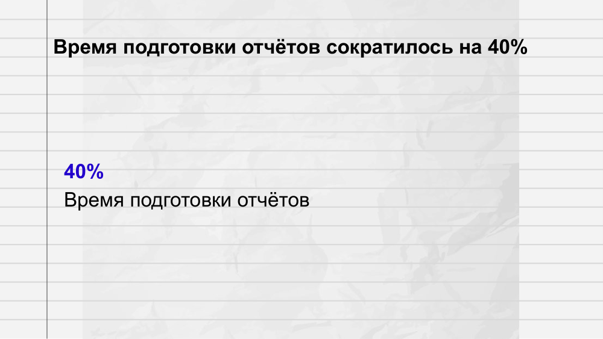
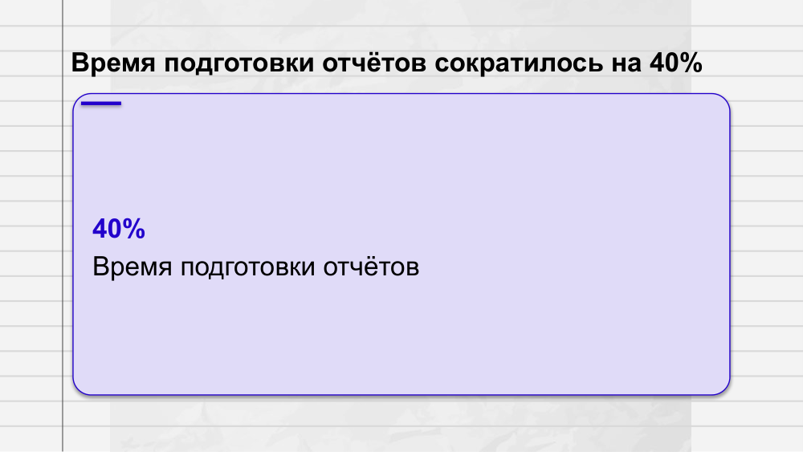
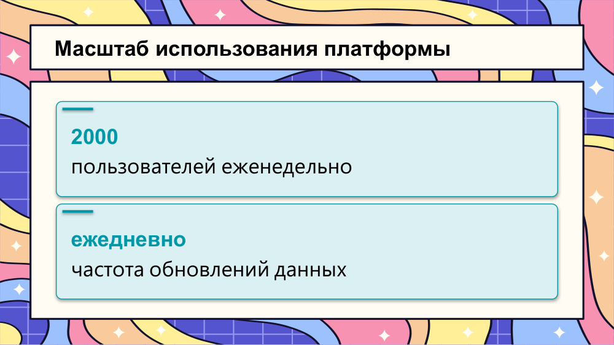
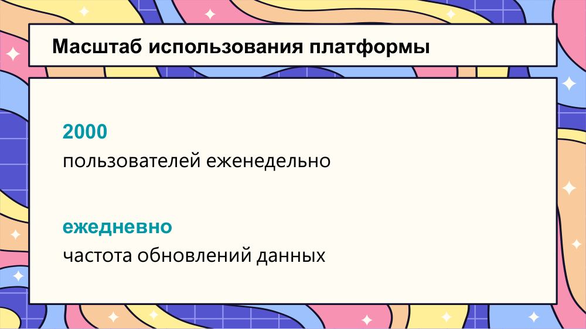
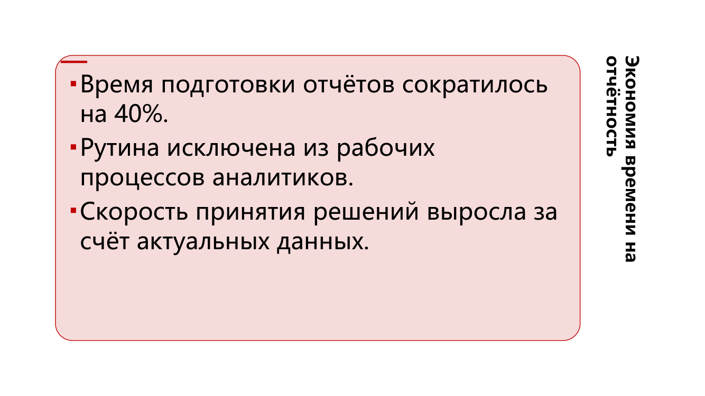
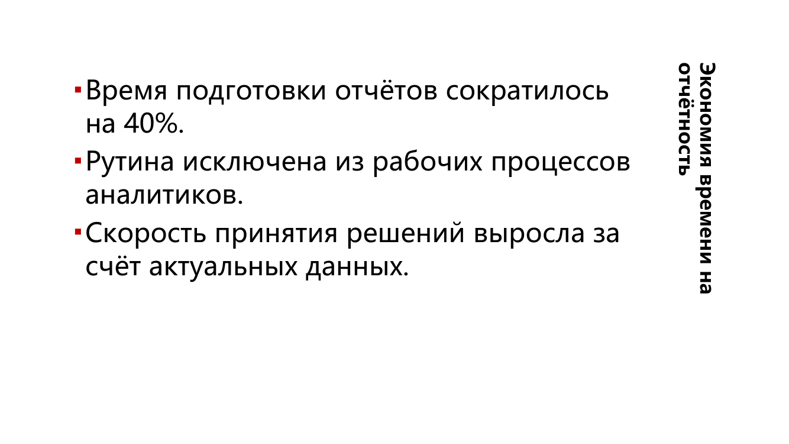

# Три варианта вёрстки: примеры и обоснование

ТЗ требует три **визуально различимых и одинаково валидных** варианта вёрстки на
одном шаблоне и одном контенте; ось различий команда определяет сама. Здесь —
примеры (3 сторонних шаблона × 3 варианта), обоснование осей и способ повторить.

## 1. Оси различий

Выбраны оси **уровня композиции**, а не косметики (перекраска или другой шрифт
не считаются вариантом вёрстки):

| Вариант | Ось | Что именно меняется | Зачем такая ось |
|---|---|---|---|
| `compact` | **плотность** | полосы во всю ширину, минимальные зазоры, порядок блоков из колоды сохраняется | раздатка и печать: максимум информации на слайде, предсказуемый порядок чтения |
| `cards` | **группировка** | каждый блок — карточка в сетке 2×N с собственной рамкой и заголовком | экран и питч: блоки считываются как независимые тезисы, легко «показать пальцем» |
| `split` | **порядок + визуализация** | блоки данных (таблица, диаграмма, фактоиды) отделяются в колонку, поднимаются выше текста | слайды, где данные важнее текста: цифра слева-сверху, пояснение рядом |

Обоснование (ADR-003): оси различимы одним предложением каждая, не зависят от
конкретного шаблона (работают только на токенах профиля: сетка, шкала, палитра)
и проверяются одним и тем же аудитом. Варианты не «лучше/хуже», а под разные
сценарии: `split` может выглядеть пустым при одном блоке — компоновщик тогда
откатывается к `compact`-раскладке.

## 2. Примеры: 3 шаблона × 3 варианта

Шаблоны — сторонние, с открытыми лицензиями (MIT): Slidesgo «Anatomy Lesson»,
Slidesgo «Fun Education Center», академический `scholar-ppt-cn`. Один и тот же
контент-пакет (VK Tech) и один бриф.

### Slidesgo «Anatomy Lesson» — `anatomy_compact.png` / `anatomy_cards.png` / `anatomy_split.png`

| compact | cards | split |
|---|---|---|
|  |  |  |

Что видно: `compact` кладёт фактоиды полосой, `cards` — карточками с рамками,
`split` выносит крупное значение в отдельную колонку. Цвета и шрифты везде —
из шаблона (акцент `#2200CC`, Georgia/Arial).

### Slidesgo «Fun Education Center» — `fun_education_*.png`

| compact | cards | split |
|---|---|---|
|  |  |  |

### `scholar-ppt-cn` (китайский академический) — `scholar_*.png`

| compact | cards | split |
|---|---|---|
|  |  |  |

Особенность шаблона: заголовок — вертикальная рамка справа (`vert270`); все три
варианта вписывают текст в неё, не обрезая (правка этапа D).

## 3. Одинаково валидны

Все девять комбинаций проходят **один и тот же аудит**: 0 ошибок; замечания —
только предупреждения (grounding/VLM), см. `docs/PROJECT_OVERVIEW.md` §7.
Проверка воспроизводится:

```bash
# аудит всех вариантов на всех доступных шаблонах
python tools/audit_matrix.py

# рендер и PNG-осмотр конкретного задания
python tools/visual_pass.py --job data/jobs/<id> --variant cards --slides 2
```

Сами PPTX в git не хранятся (ADR-002, большие бинарники) — в репозитории
остаются скриншоты (здесь) и JSON-профили шаблонов (`template_profiles/`,
`docs/evidence/external/*.profile.json`).
